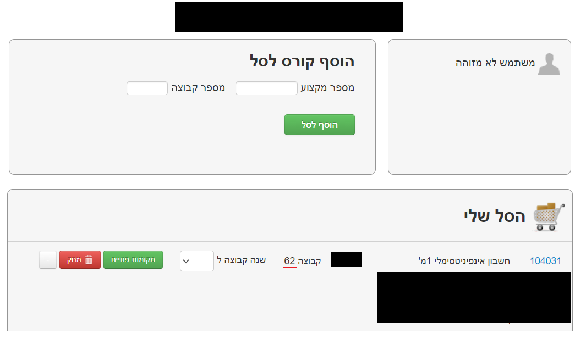

# technion-courses-bot

Use this simple bot to easily and automatically register yourself to the desired courses of this semester.

## Setup

First clone this repository. Then open terminal, type `npm i` and press enter to install all required packages.

Go to `.env` file and fill it as follow:

- _**TECH_USERNAME**_ - Write your Technion username, probably your ID
- _**TECH_PASSWORD**_ - Write your Technion password, the secret code sent in SMS message
- _**COURSES_LIST**_ - Write all your courses numbers and group numbers in a row, with no spaces:

  ```
  (Course number)(group number)(Course 2 number)(group 2 number)...
  ```

  _Parenthesis are used for readability only, don't use them!_

  Use the image below to understand where to take the numbers from:
  <br /><br />
  

  _Course Number_ is the **6** digit number in blue

  _Group Number_ is the **2** digit number

  In the list this course will appear as:

  ```
  ...10403162...
  ```

- _**TWO_CAPTCHA_TOKEN**_ - Write your [2Captcha](https://2captcha.com/) API key here.

  **Note** This is a paid service (2.99$ for 1000 captchas) which you will have to register to and add funds.

  After you register, you will see your API key in their dashboard

  ## Activate

  After finishing the project set-up, you are ready to start!

  Open the terminal again and run `node .`.

  That's it, you are set!

  <br/>

  \* The bot runs once a minute when activated, and will try to submit your courses.
